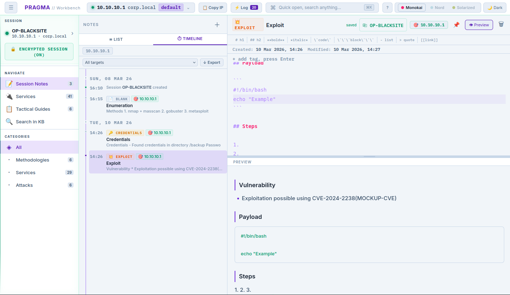
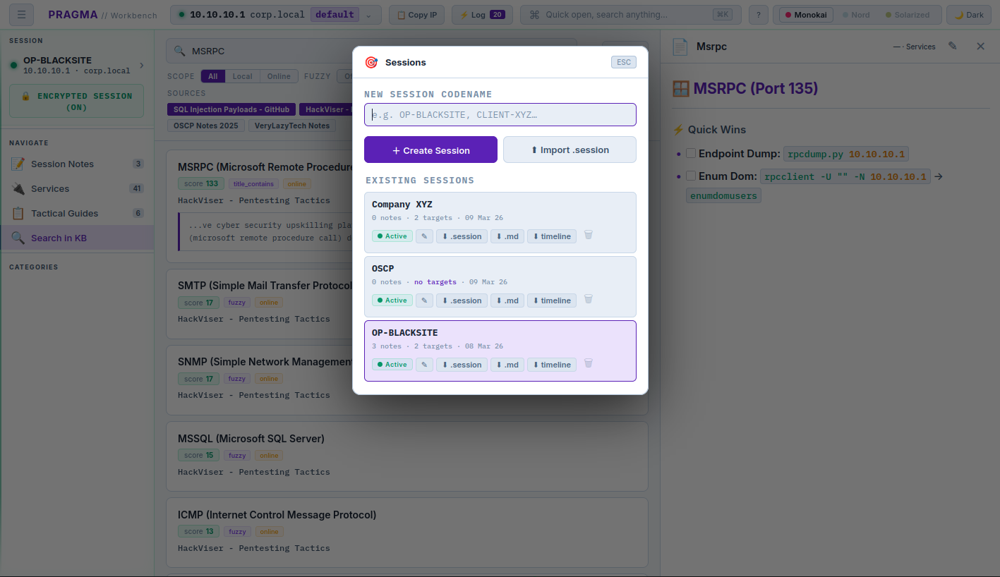
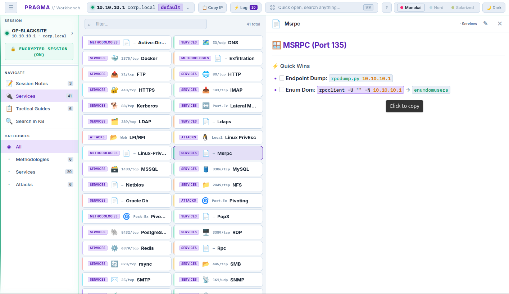
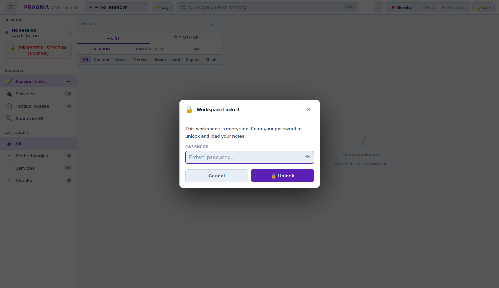

# #️ PRAGMA // Workbench

> A local workbench for pentest notes, encrypted sessions, and a target-aware KB — no cloud, no clutter.

---
## 🚩 My Problem

Pentest workflows are fragmented — notes, findings, and knowledge live in different places, breaking focus and increasing cognitive load. Generic note tools lack structure, reporting platforms are too rigid, and cloud solutions add risk.

## ❌ What it is NOT

- **Not a reporting tool** — notes are for operational use, only drafts and not deliverables
- **Not a team platform** — single-operator, local-first by design
- **Not a scanner, exploit framework or automation platform** — it does not touch your targets or automate any scanning or exploitation
- **Not cloud-dependent** — everything runs locally on your machine, and nothing leaves it


## ✅ What it IS

- **A local web application** — PRAGMA runs entirely on your machine, combining structured note-taking with a searchable knowledge base
- **A workflow workbench** — built to support the natural flow of a penetration test, from initial access to post-exploitation with findings, without breaking focus
- **A knowledge-integrated interface** — integrated search functionality with ENGRAM (local knowledge base indexer on `http://localhost:3002` or `http://engram:3002` in docker-network) to enable full-text knowledge base lookups from defined online sources directly inside the app

## 📸 Screenshots
<p align="left">
  <a href="./screenshots/pragma-session-notes.png" target="_blank"></a>
  <a href="./screenshots/pragma-sessions.png" target="_blank"></a>
  <a href="./screenshots/pragma-kb.png" target="_blank"></a>
</p>
<p align="left">
  <a href="./screenshots/pragma-encrypted-workbench.png" target="_blank"></a>
  <a href="./screenshots/pragma-workbench-locked.png" target="_blank"></a>
</p>

## 🏷️ Features

**Sessions & Targets**
- Named sessions with multi-target tracking (IP, domain, label)
- Active target auto-injects into all code blocks at copy time across KB and Tactical Guides
- Session status tracking (Active / Paused / Complete) with timeline view
- Export/import sessions as JSON for portability; notes export as structured markdown

**Encryption**
- Full workbench encryption (AES-256-GCM, PBKDF2-SHA-512, 600k iterations) — client-side only
- Server stores ciphertext; password never touches disk, localStorage, or the network
- Workbench file is portable — moving to another machine is a file copy

**Notes**
- Typed notes with structured markdown templates — see [Note Templates](#-note-templates) below
- Full-text search across note titles and bodies, with type/tag/target/scope filters
- Tags, pin, auto-save, per-note `.md` export with YAML frontmatter, and duplicate
- Session reassignment, target assignment, and Timeline view for chronological activity
- Checklist support (`- [ ]` / `- [x]`) in preview with live sync-back to source
- Tool output parser — paste raw output from `nmap`, `masscan`, `gobuster` and similar tools directly into notes with structured formatting

**Quick Log (`Ctrl+L`)**

A persistent in-session log accessible from the topbar, organised into three tabs:

- **Ports** — log open ports and services manually or by pasting raw output from `nmap`, `rustscan`, or `masscan`. Parsed automatically into structured rows (port, proto, service, version, notes)
- **Paths** — log web paths from directory and vhost enumeration. Accepts raw output from `gobuster`, `ffuf`, and `dirbuster`, or manual entry with optional HTTP status code
- **Loot** — log credentials, hashes, tokens and keys found during the engagement. Each entry has a type tag (Cleartext / Hash / Token / Key / Other), a host field (auto-filled from the active target), and a context note. Credentials are click-to-copy

All three tabs persist per session alongside notes and are included in session exports. Loot entries are exported as a separate `loot.md` file (grouped by host) when exporting notes as markdown.

**Knowledge Base & Tactical Guides**
- Indexes all `.md` files under `knowledge_base/` recursively — each subdirectory becomes a category automatically (only `tactics/` is reserved for Tactical Guides)
- Editable in-UI with live disk write-back and auto re-index on change
- Every code block and inline backtick span is click-to-copy with target IP injected
- Full-text search with weighted relevance scoring, fuzzy matching, and per-result match type (exact / fuzzy / partial)
- Local/remote scope filter, source filter, and query-term snippet highlighting in results
- Degrades gracefully if ENGRAM is offline, with a one-click reachability check

**Workbench Reliability**
- Atomic writes — every save is written to a temp file first, then renamed into place, preventing corruption from crashes or power loss
- Rolling backups — the last 5 versions of your workbench are kept automatically in `sessions/backup/`
- Automatic fallback recovery — if the live workbench file is corrupt or missing, PRAGMA silently loads from the most recent valid backup
- Startup integrity check — on every start, PRAGMA logs the workbench state, backup count, and any issues detected

**Interface**
- Command palette (`⌘K`), keyboard shortcuts for all major actions, dark/light mode
- Quick Log (`Ctrl+L`) — see above

---

## 📝 Note Templates

PRAGMA ships with six built-in note templates. Each opens with a pre-structured markdown body, relevant default tags, and a title prefix to keep notes consistent across engagements.

| Template | Icon | Default Tags | Purpose |
|---|---|---|---|
| **General** | 📋 | — | Free-form notes with Overview / Notes / References sections |
| **Credentials** | 🔑 | `creds` | Credential table, password spray notes, valid sessions |
| **Recon** | 🔭 | `recon` | Target overview, open ports, web endpoints, DNS, users |
| **PrivEsc** | ⬆ | `privesc` | System info, enumeration checklist, vectors tried, escalation path |
| **Loot** | 💰 | `loot` | Exfiltrated files, credentials found, flags/proofs |
| **Exploit** | 💥 | `exploit` | CVE/CVSS metadata, payload, steps, outcome, cleanup |

### Custom Templates (`notes-templates.json`)

You can extend or fully replace the built-in templates by placing a `notes-templates.json` file next to `server.js`. On startup, PRAGMA loads it and uses it as the sole source of templates — built-ins are replaced entirely (except `Blank`, which is always kept).

**Schema:**

```json
{
  "templates": [
    {
      "id": "tunneling",
      "label": "Tunneling",
      "icon": "🕳️",
      "title_prefix": "Tunnel",
      "default_tags": ["tunneling", "pivot"],
      "body": "## Setup\n\n## Listeners\n\n## Routes\n\n"
    }
  ]
}
```

| Field | Required | Description |
|---|---|---|
| `id` | ✅ | Unique identifier, lowercase, no spaces |
| `label` | ✅ | Display name shown in the template picker |
| `icon` | — | Emoji shown on the note type badge |
| `title_prefix` | — | Prepended to the note title on creation |
| `default_tags` | — | Array of tags automatically applied to the note |
| `body` | — | Initial markdown content for the note body |

Custom templates appear in the picker with a purple border and a **CUSTOM** heading to distinguish them from built-ins. If the file is missing, malformed, or empty, PRAGMA falls back to the built-in templates silently.

---

## 🔐 Security

PRAGMA is a **single-operator, local-first tool** designed to run in a controlled environment — ideally a dedicated pentest VM. It has no authentication layer, no multi-user access control, and no network hardening beyond what the host OS provides. The security model assumes the operator controls the machine it runs on.

### Encryption

- Workbench encryption uses **AES-256-GCM** with **PBKDF2-SHA-512** key derivation at 600,000 iterations
- Encryption and decryption happen **entirely in the browser** — the password never touches disk, localStorage, server memory, or the network
- The server stores only the ciphertext blob and refuses plaintext writes while an encrypted workbench is active
- Disabling encryption requires supplying the decrypted payload to the server — a bare unauthenticated request is rejected, preventing accidental or console-based erasure of the workbench file
- If the password prompt is cancelled or decryption fails on load, the application halts and renders a locked screen — no data is written and no UI is exposed

### Deployment recommendations

- **Run on localhost only** — PRAGMA binds to `127.0.0.1:3000` by default. Do not expose it on a LAN, VPN, or any network interface accessible to others. Your session notes, targets, and KB content are sensitive operational data
- **Use a dedicated pentest VM** — the recommended setup is a VM used exclusively for pentesting, with PRAGMA running locally inside it. This isolates your notes from your host OS and limits exposure if the VM is compromised
- **Do not run as root** — the Docker setup drops all capabilities and runs as a non-root user. If running with Node.js directly, use a standard user account
- **Encrypt your workbench** — if your notes contain credentials, findings, or client-sensitive data, enable workbench encryption. The workbench file is portable and encrypted at rest, so even if the file is copied off the machine it cannot be read without the password
- **Back up your workbench file** — the rolling backup system keeps the last 5 versions automatically. For additional safety, use the **⬇ Restore backup** button in the sidebar to download a copy to your host machine

### What encryption does NOT protect against

- An attacker with active access to the running browser session (the plaintext is in memory while unlocked)
- Keyloggers or screen capture on the host machine
- A compromised VM where the attacker can observe the browser process

These are outside the threat model for a local single-operator tool. If your VM is compromised during an engagement, your notes are the least of your concerns.

---

## 🎯 Target Injection Reference

When a session has an active target set, PRAGMA automatically replaces placeholder variables in KB documents and Tactical Guides with the target's IP and domain — highlighted in yellow on render, and injected at copy time in code blocks.

Write your KB docs using any of the supported placeholder styles below.

### IP / Host → Active Target IP

| Style | Supported placeholders |
|---|---|
| Angle brackets | `<IP>` `<ip>` `<TARGET>` `<TARGET_IP>` `<target_ip>` `<RHOST>` `<rhost>` `<HOST>` `<host>` `<MACHINE_IP>` |
| Shell variables | `$IP` `$RHOST` `$TARGET` `$TARGET_IP` `$HOST` |
| Curly braces | `{IP}` `{ip}` `{RHOST}` `{rhost}` `{TARGET}` `{HOST}` `{host}` |
| Double curly | `{{ip}}` `{{IP}}` `{{target}}` `{{rhost}}` `{{host}}` `{{HOST}}` |
| Bare words | `TARGET_IP` `TARGET_IP_ADDRESS` `RHOST` `TARGET` `MACHINE_IP` |
| HTB-style literals | `10.10.10.X` `10.10.X.X` |
| Backtick-scoped only | \`IP\` \`HOST\` — injected **only inside inline code**, not in plain prose |

### Domain / FQDN → Active Target Domain

| Style | Supported placeholders |
|---|---|
| Angle brackets | `<DOMAIN>` `<domain>` `<TARGET_DOMAIN>` `<FQDN>` `<fqdn>` `<DC>` `<dc>` `<WORKGROUP>` |
| Shell variables | `$DOMAIN` `$FQDN` `$DC` |
| Curly braces | `{DOMAIN}` `{domain}` `{FQDN}` |
| Double curly | `{{domain}}` |
| Bare words | `TARGET_DOMAIN` `DOMAIN` `WORKGROUP` |

> **Note on bare `IP` and `HOST`:** These are common English words, so global replacement would cause false positives in prose. PRAGMA only injects them when wrapped in backticks — e.g. `` `nmap -sV IP` `` or `` `curl HOST/api` `` — leaving sentences like *"Enter the target IP"* untouched.

---

## 🛠️ Requirements

- Node.js 20+
- **Optional:** 
    - docker & docker-compose
    - [ENGRAM](https://github.com/VJakoby/engram) — Required for search of indexed online sources.

See [DOCKER.md](./DOCKER.md) for the full project directory structure, volume mounts, and how to run both PRAGMA and ENGRAM together over a shared Docker network.

## 🚀 Quick Start

See [DOCKER.md](./DOCKER.md) for full Docker instructions.

```bash
# Build and start
docker compose up -d --build

# Access at
http://localhost:3000
```

### Running manually with Node.js
```bash
# 1. Install dependencies
npm install

# 2. Start the server
npm start

# 3. Open in browser
http://localhost:3000
```

---
Created by VJakoby + 🤖 | Licensed under MIT | [View AI & Architectural Disclosure](./AI-DISCLOSURE.md)