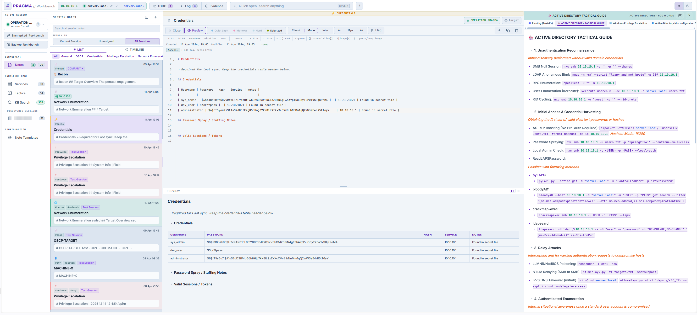
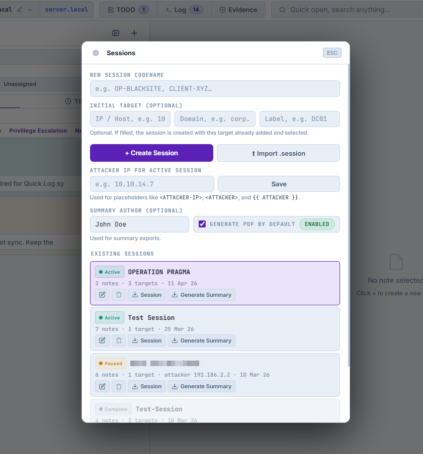
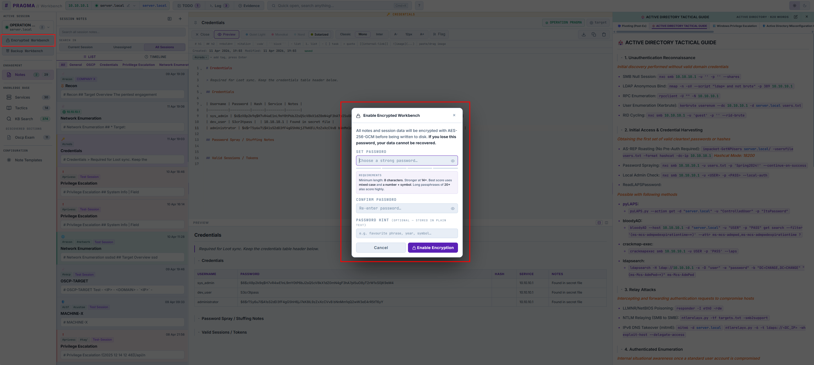
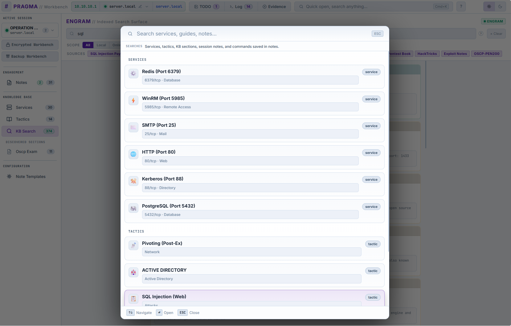
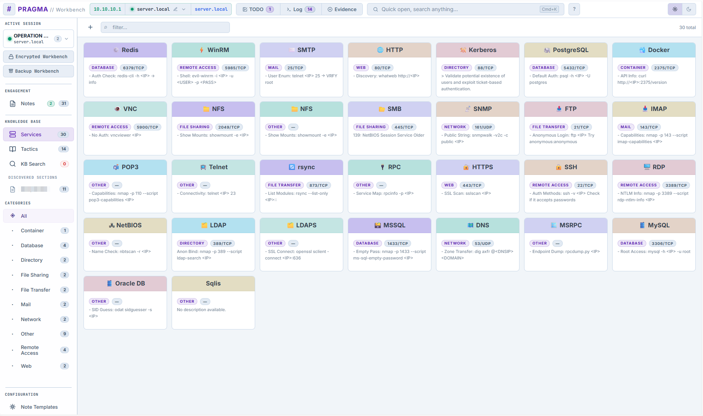
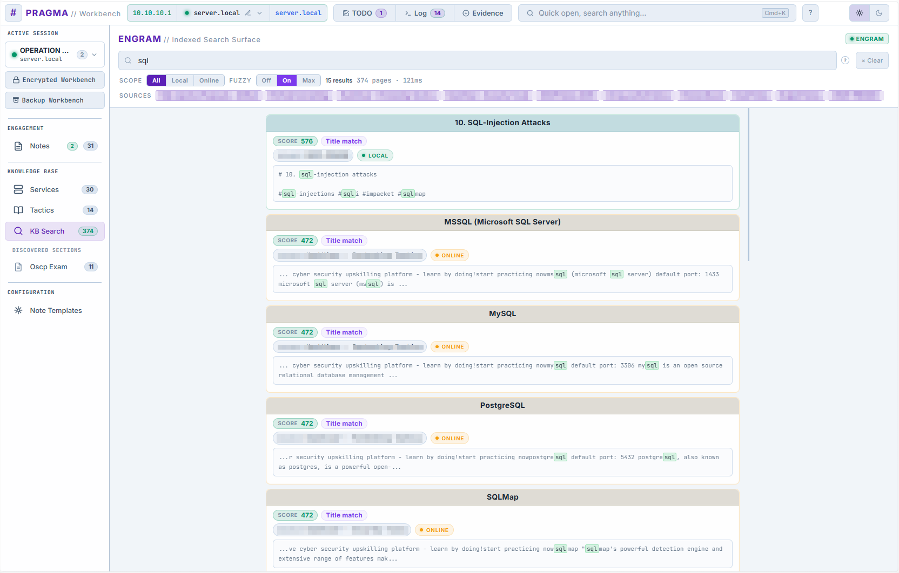

<table>
  <tr>
    <td valign="middle">
      
    </td>
  </tr>
</table>

**PRAGMA** is an operational workspace built for pentest engagements and CTF — not a note app that happens to run on localhost.

At its core: a focused Markdown editor organized around sessions and targets, with a right-side context panel that surfaces your KB, tactics, and search results without pulling you out of the flow. Evidence and loot capture is first-class, not bolted on.

---

## ⚠️ Notice

PRAGMA is a documentation and workflow tool for security testing.

It does not interact with targets directly, but is intended for use in authorized environments only, such as professional engagements, lab setups, and CTF platforms.

You are responsible for ensuring your work complies with applicable laws and rules of engagement.

---
## 🚩 The problem it solves

Pentest work demands focus, but the tools don't support it. Notes end up in one place, findings in another, methodology references somewhere else entirely. Generic editors have no concept of an engagement. Reporting platforms are built for output, not the process. 

PRAGMA keeps everything in the same view — structured enough to be useful, local enough to be trusted.

## ❌ What it is NOT

- **Not a reporting tool** — notes are for operational use, only drafts and not final deliverables
- **Not a team platform** — single-operator, local-first by design
- **Not a exploit framework** — it does not exploit your targets
- **Not cloud-dependent** — everything runs locally on your machine, and nothing leaves it


## ✅ What it IS

- **A local web application** — PRAGMA runs entirely on your machine, combining structured note-taking with a searchable knowledge base
- **A workflow workbench** — built to support the natural flow of a penetration test, from initial access to post-exploitation with findings, without breaking focus
- **A knowledge-integrated interface** — local KB search is built in, and ENGRAM integration is optional for searching indexed external sources from inside the app

## Screenshots

Here are a few screenshots to give a quick impression of the platform. They help show the shape of the workflow, but the real value is in using it directly and experiencing how the views fit together during actual work.


<table align="center">
  <tr align="center" valign="middle">
    <td width="33%">
      
    </td>
    <td width="33%">
      
    </td>
    <td width="33%">
      
    </td>
  </tr>
  <tr align="center" valign="top">
    <td><em>Main View — central workbench for active engagement notes and context</em></td>
    <td><em>Sessions — organize multiple engagements within a single workbench</em></td>
    <td><em>Encryption — client-side encrypted storage for workbench data</em></td>
  </tr>
</table>

<table align="center">
  <tr align="center" valign="middle">
    <td width="33%">
      
    </td>
    <td width="33%">
      
    </td>
    <td width="33%">
      
    </td>
  </tr>
  <tr align="center" valign="top">
    <td>
      <em>Command Palette — quick-open search across notes, KB, tactics, and commands</em>
    </td>
    <td>
      <em>KB Cards — browse services, tactics, and KB sections in a card layout</em>
    </td>
    <td>
      <em>Indexed Search — ENGRAM-powered results inside the workbench</em>
    </td>
  </tr>
</table>


## 👤 Who This Is For

PRAGMA exists because this is the workflow I wanted for myself.

It is not trying to solve everybody else's note-taking, reporting, or engagement-management problem. It is opinionated, local-first, and built around how I prefer to work during an assessment. If that fits your way of operating, use it. If it does not, do not.

That is intentional. The goal is not to be universal. The goal is a better structured workflow.

## 🗂️ Workspace Model

PRAGMA is structured in three levels:

- **Workbench** — the local workspace on your machine. A single workbench can contain multiple sessions.
- **Session** — an engagement, project, machine set, or working context. A session can contain one target or many.
- **Target** — a concrete IP, domain, or labeled host entry inside a session.

This means PRAGMA does not force one workflow:

- one workbench can hold several parallel engagements
- one session can represent a single machine
- one session can also represent a broader engagement with multiple targets

Titles and note content stay flexible, while session assignment and target assignment provide the explicit structure.

## 🎯 Focus Model

PRAGMA is built around a simple interaction rule:

- **Engagement Notes are the primary workspace** during an engagement
- **Knowledge Base, Tactics, search, and quick-log are supporting tools**
- supporting views should help you retrieve context, not pull you out of the note-taking flow unnecessarily

In practice, this means the app is opinionated about staying operational:

- notes are where active engagement context lives
- services, tactics, and indexed KB content are there to support the current note/work, not replace it
- when possible, supporting content should open beside the current note rather than forcing a full context switch

For a practical walkthrough of how the app is meant to be used during an engagement, see [USAGE.md](./USAGE.md).

## 🧱 Tech Stack

| Area | Technology | Notes |
|---|---|---|
| Runtime | Node.js | App server and local runtime |
| Backend | Express | API routes, static assets, and EJS view serving |
| Templating | EJS | Server-rendered app shell and partials |
| Frontend | Vanilla JavaScript | Modular browser scripts under `public/app/` |
| Editors | CodeMirror 6 | Markdown editing for notes and KB content |
| Markdown Rendering | `marked` | KB and server-side markdown rendering |
| Search | Fuse.js | Local fuzzy search and KB relevance scoring |
| Encryption | Web Crypto API | Client-side AES-256-GCM + PBKDF2-SHA-512 |
| Storage | File-backed JSON + Markdown | Sessions/workbench state on disk, KB as `.md` files |
| Containerization | Docker / Docker Compose | Optional local container runtime |

## 🏷️ Features

**Sessions & Targets**
- Named sessions with multi-target tracking (IP, domain, label)
- Session-level attacker IP field for callback/reverse-shell style placeholders
- Active target auto-injects into all code blocks at copy time across the KB and tactics
- Session status tracking (Active / Paused / Complete) with timeline view
- Export/import sessions as JSON for portability; session exports also support structured markdown bundles and a consolidated markdown export

**Encryption**
- Full workbench encryption (AES-256-GCM, PBKDF2-SHA-512, 600k iterations) — client-side only
- Server stores ciphertext; password never touches disk, localStorage, or the network
- Workbench file is portable — moving to another machine is a file copy

**Notes**
- Typed notes with structured markdown templates — see [Note Templates](#-note-templates) below
- Note templates support per-template variants, so one template type can expose multiple predefined workflows or note layouts

**Quick Log (`Ctrl+L`)**

A persistent in-session capture tool accessible from the topbar:

- **Ports** — log open ports and services manually or by pasting raw output from `nmap`, `rustscan`, or `masscan`. Parsed automatically into structured rows (port, proto, service, version, notes)
- **Paths** — log web paths from directory and vhost enumeration. Accepts raw output from `gobuster`, `ffuf`, and `dirbuster`, or manual entry with optional HTTP status code
- **Loot** — log credentials, hashes, tokens and keys found during the engagement. Each entry has a type tag (Cleartext / Hash / Token / Key / Other), a host field (auto-filled from the active target), and a context note. Credentials are click-to-copy
Ports, paths, and loot persist per session alongside notes. Ports and credentials can also sync into structured notes such as `Network Enumeration` and `Credentials`, reducing duplicate capture.

**TODO**

A session-wide checkbox list for next steps, kept alongside the session so unfinished tasks persist across reloads and later reopen.

**Evidence**

PRAGMA also includes a dedicated Evidence workflow for preserving proof directly from session notes, rather than retyping it into a second table.

- **Selection-driven capture** — select a command, line, or markdown block in the note editor and use **Add as Evidence**
- **Typed evidence entries** — supported categories include Enumeration, Initial Access, Execution, Persistence, Privilege Escalation, Credential Access, Discovery, Lateral Movement, Pivoting, Collection, Exfiltration, Cleanup, and Proof
- **Source-linked tracking** — each Evidence entry stays linked to the original note and supports jumping back to the exact flagged source block
- **Optional Loot creation** — when adding Evidence, you can also create a Loot entry from the same selection and optionally sync cleartext/hash material into the `Credentials` note
- **Evidence management** — the Evidence panel supports filtering by type and target, inline editing, and unflagging while keeping the original note content
- **Clean markdown export** — Evidence markers are used internally in notes, but are stripped from exported markdown/session exports so generated files stay readable

This makes Evidence the primary workflow for preserving proof from notes, while Loot remains the specialized structured store for credentials, tokens, keys, and similar material.

**Knowledge Base & Tactics**
- Indexes local `.md` files from `knowledge_base/` with three distinct surfaces: `knowledge_base/services/` feeds the Services view, `knowledge_base/tactics/` feeds the Tactics view, and other top-level folders become standalone KB sections
- The repository does not ship with a real KB corpus. Each user is expected to point PRAGMA at their own local knowledge base content
- Editable in-UI with live disk write-back and auto re-index on change
- Every code block and inline backtick span is click-to-copy with target IP injected
- Full-text search with weighted relevance scoring, fuzzy matching, and per-result match type (exact / fuzzy / partial)
- Local/remote scope filter, source filter, and query-term snippet highlighting in results
- Degrades gracefully if ENGRAM is offline, with a one-click reachability check
- Local KB previews support quick switching between sibling notes in the same category/folder

**Workbench Reliability**
- Atomic writes — every save is written to a temp file first, then renamed into place, preventing corruption from crashes or power loss
- Rolling backups — the last 5 versions of your workbench are kept automatically in `sessions/backup/`
- Automatic fallback recovery — if the live workbench file is corrupt or missing, PRAGMA silently loads from the most recent valid backup
- Startup integrity check — on every start, PRAGMA logs the workbench state, backup count, and any issues detected

**Interface**
- Command palette (`⌘K`), keyboard shortcuts for all major actions, dark/light mode
- Quick Log (`Ctrl+L`) — see above

---

## 📝 Note Templates

PRAGMA supports built-in note templates. Each opens with a pre-structured markdown body, relevant default tags, and a title prefix to keep notes consistent across engagements.

Some automation relies on specific templates being present. For example, Quick Log ports/paths sync creates and updates a `network-enumeration` note, and Loot → Credentials sync requires a `credentials` note. If you remove those templates from `note-templates.json`, the auto-created documents will no longer appear. The templates can be minimal; they just need the matching table headers so sync can find them.

Templates can also define **variants**. A single template type can expose multiple selectable versions in the new-note flow, each with its own title prefix, default tags, and markdown body. This is useful when one note category needs several operating modes, for example:

- an OSCP template with separate `Exam Target`, `Practice`, and `AD Workflow` variants
- a Credentials template with different layouts for general credentials vs AD credentials
- a Recon template with different structures for web, network, or cloud-focused recon

| Template | Icon | Default Tags | Purpose |
|---|---|---|---|
| **General** | 📋 | — | Free-form notes with Overview / Notes / References sections |
| **Credentials** | 🔑 | `creds` | Credential table, password spray notes, valid sessions |
| **Recon** | 🔭 | `recon` | Target overview, open ports, web endpoints, DNS, users |
| **Network Enumeration** | 🌐 | `network` | Per-target target overview plus synchronized open ports and services |
| **PrivEsc** | ⬆ | `privesc` | System info, enumeration checklist, vectors tried, escalation path |
| **Loot** | 💰 | `loot` | Exfiltrated files, credentials found, flags/proofs |
| **Exploit** | 💥 | `exploit` | CVE/CVSS metadata, payload, steps, outcome, cleanup |

### Custom Templates (`note-templates.json`)

You can extend or fully replace the built-in templates by editing `note-templates.json` next to `server.js`. PRAGMA exposes this directly in the app under `Configuration -> Note Templates`, and also loads the same file on startup as the source of templates.

**Schema:**

```json
{
  "templates": [
    {
      "id": "tunneling",
      "label": "Tunneling",
      "icon": "🕳️",
      "title_prefix": "Tunnel",
      "default_tags": ["tunneling", "pivot"],
      "body_lines": [
        "## Setup",
        "",
        "## Listeners",
        "",
        "## Routes",
        ""
      ],
      "variants": [
        {
          "id": "ligolo",
          "label": "Ligolo",
          "title_prefix": "Tunnel",
          "default_tags": ["tunneling", "pivot", "ligolo"],
          "body_lines": [
            "## Listener",
            "",
            "## Agent",
            ""
          ]
        }
      ]
    }
  ]
}
```

| Field | Required | Description |
|---|---|---|
| `id` | ✅ | Unique identifier, lowercase, no spaces |
| `label` | ✅ | Display name shown in the template picker |
| `icon` | — | Emoji shown on the note type badge |
| `title_prefix` | — | Prepended to the note title on creation |
| `default_tags` | — | Array of tags automatically applied to the note |
| `body` | — | Initial markdown content for the note body as a single JSON string |
| `body_lines` | — | Multi-line template body as an array of strings; joined with `\n` on load |
| `variants` | — | Array of selectable template variants. Each variant can define its own `id`, `label`, `icon`, `title_prefix`, `default_tags`, `body`, or `body_lines` |

Use either `body` or `body_lines`. `body_lines` is easier to read and maintain for longer markdown templates.

If `variants` are present, PRAGMA shows a second selection step in the note-creation flow. The chosen variant becomes the note's starting layout and can override the parent template's defaults.

Custom templates appear in the picker with a purple border and a **Custom** heading to distinguish them from built-ins. If the file is missing, malformed, or empty, PRAGMA falls back to the built-in templates silently.

### Images in Notes

Notes also support pasted and dropped screenshots/images.

- Paste a copied screenshot directly into the editor with `Ctrl+V`
- Drag a local image file into the editor
- PRAGMA stores the image as a note attachment and inserts standard markdown image syntax automatically:

```md

```

This keeps image handling compatible with normal markdown preview/rendering while still using PRAGMA's note-scoped attachment storage.

---

## 🔐 Security

PRAGMA is a single-operator, localhost-first tool. It is designed for use on a controlled machine, ideally a dedicated pentest VM.

High-level security position:

- binds to `127.0.0.1` by default
- supports encrypted workbench storage with client-side AES-256-GCM
- treats imported/session/markdown content as untrusted input
- is not intended for hostile internet-facing multi-user deployment

For the actual threat model, mitigations, verified checks, and remaining review areas, see [SECURITY.md](./SECURITY.md).

---

## 🎯 Target Injection Reference

When a session has an active target set, PRAGMA automatically replaces placeholder variables in KB documents and tactics with the target's IP and domain — highlighted in yellow on render, and injected at copy time in code blocks.

Write your KB docs using any of the supported placeholder styles below.

### IP / Host → Active Target IP

| Style | Supported placeholders |
|---|---|
| Angle brackets | `<IP>` `<ip>` `<TARGET>` `<TARGET_IP>` `<target_ip>` `<RHOST>` `<rhost>` `<HOST>` `<host>` `<MACHINE_IP>` |
| Shell variables | `$IP` `$RHOST` `$TARGET` `$TARGET_IP` `$HOST` |
| Curly braces | `{IP}` `{ip}` `{RHOST}` `{rhost}` `{TARGET}` `{HOST}` `{host}` |
| Double curly | `{{ip}}` `{{IP}}` `{{target}}` `{{rhost}}` `{{host}}` `{{HOST}}` |
| Bare words | `TARGET_IP` `TARGET_IP_ADDRESS` `RHOST` `TARGET` `MACHINE_IP` |
| HTB-style literals | `10.10.10.X` `10.10.X.X` |
| Backtick-scoped only | \`IP\` \`HOST\` — injected **only inside inline code**, not in plain prose |

### Domain / FQDN → Active Target Domain

| Style | Supported placeholders |
|---|---|
| Angle brackets | `<DOMAIN>` `<domain>` `<TARGET_DOMAIN>` `<FQDN>` `<fqdn>` `<DC>` `<dc>` `<WORKGROUP>` |
| Shell variables | `$DOMAIN` `$FQDN` `$DC` |
| Curly braces | `{DOMAIN}` `{domain}` `{FQDN}` |
| Double curly | `{{domain}}` |
| Bare words | `TARGET_DOMAIN` `DOMAIN` `WORKGROUP` |

> **Note on bare `IP` and `HOST`:** These are common English words, so global replacement would cause false positives in prose. PRAGMA only injects them when wrapped in backticks — e.g. `` `nmap -sV IP` `` or `` `curl HOST/api` `` — leaving sentences like *"Enter the target IP"* untouched.

---

## Optional Modules

PRAGMA works on its own. Optional modules extend the workbench, but they are not required for the core note/session workflow.

### ENGRAM // Indexed Search Surface

ENGRAM is an optional companion service that powers PRAGMA's KB search surface. When enabled, PRAGMA queries ENGRAM for indexed results; when disabled, the module stays offline and search falls back to local content only.

- Repo: [ENGRAM // Indexed Search Surface](https://github.com/VJakoby/engram)
- Purpose: index and serve KB content for fast, ranked search results inside PRAGMA
- Integration model: ENGRAM runs as its own local service, and PRAGMA points at it via `SEARCH_URL`

To bring ENGRAM up as a separate container:

```bash
cd ~/engram
docker compose build --no-cache
docker compose up -d
```

Verify it is reachable:

```bash
curl http://127.0.0.1:3002/healthz
```

To enable it in PRAGMA:

```env
SEARCH_URL=http://127.0.0.1:3002
```

Then restart PRAGMA. If ENGRAM is online, `KB Search` will show indexed results.

### PRAGMA // Toolbox

PRAGMA // Toolbox is an optional companion service that can assist with selected passive recon and active enumeration workflows. It is exposed inside PRAGMA as the `Toolbox` module when enabled.

- Repo: [PRAGMA // Toolbox](https://github.com/VJakoby/matrix-toolbox)
- Purpose: provide API-backed helper workflows such as passive recon, Nmap enumeration, and Masscan enumeration without turning PRAGMA itself into a scanner platform
- Integration model: PRAGMA // Toolbox runs as its own local service, and PRAGMA talks to it through the optional Toolbox proxy routes

Detailed PRAGMA // Toolbox setup is shown in the quick-start section below.

---

## 🛠️ Requirements

- Node.js 20+
- **Optional:**
  - Docker and `docker compose`
  
See [DOCKER.md](./DOCKER.md) for the full project directory structure, volume mounts, and how to run PRAGMA with an external ENGRAM instance over a shared Docker network.

---

## 🚀 Quick Start

See [DOCKER.md](./DOCKER.md) for full Docker instructions.

Recommended Docker workflow:

```bash
# 1. Create a local env file
cp .example.env .env

# 2. Edit .env and point PRAGMA_KB_PATH to your local knowledge base
#    (and PRAGMA_SESSIONS_PATH if you want runtime data somewhere else)

# 3. Choose whether PDF export should be enabled
#    PDF_EXPORT_ENABLED=true  -> PDF export enabled and Chromium included in the image
#    PDF_EXPORT_ENABLED=false -> PDF export disabled and Chromium omitted on rebuild

# 4. Build and start
docker compose up -d --build

# 5. Access at
http://localhost:3000
```

### PRAGMA // Toolbox

PRAGMA // Toolbox is an optional companion service that can assist with selected passive recon and active enumeration workflows. It is exposed inside PRAGMA as the `Toolbox` module when enabled.

- Repo: [PRAGMA // Toolbox](https://github.com/VJakoby/matrix-toolbox)
- Purpose: provide API-backed helper workflows such as passive recon, Nmap enumeration, and Masscan enumeration without turning PRAGMA itself into a scanner platform
- Integration model: PRAGMA // Toolbox runs as its own local service, and PRAGMA talks to it through the optional Toolbox proxy routes

To bring PRAGMA // Toolbox up as a separate container:

```bash
cd ~/matrix-toolbox
docker compose build --no-cache
docker compose up -d
```

Verify it is reachable:

```bash
curl http://127.0.0.1:3003/healthz
```

To enable it in PRAGMA:

```env
TOOLBOX_ENABLED=true
TOOLBOX_URL=http://127.0.0.1:3003
```

Or use fallback URLs:

```env
TOOLBOX_ENABLED=true
TOOLBOX_URLS=http://matrix:3003,http://host.docker.internal:3003,http://127.0.0.1:3003
```

Then restart PRAGMA. If enabled, `Toolbox` appears in the sidebar. If disabled, the module is hidden entirely.

Compatibility note:

- `TOOLBOX_*` is now the preferred config surface
- legacy `MATRIX_*` variables are still accepted as fallbacks for existing setups

In short:

1. build and start PRAGMA // Toolbox as its own service/container
2. point PRAGMA at the PRAGMA // Toolbox API
3. enable `TOOLBOX_ENABLED=true`
4. restart PRAGMA

Common `.env` values include:

- `TOOLBOX_ENABLED`
- `TOOLBOX_URL`
- `TOOLBOX_URLS`
- `PRAGMA_KB_PATH`
- `PRAGMA_SESSIONS_PATH`
- `PDF_EXPORT_ENABLED`
- `PRAGMA_UID`
- `PRAGMA_GID`
- `SEARCH_URL`

`PDF_EXPORT_ENABLED` is now the single PDF-related setting:

- `true` enables PDF export and builds Chromium into the image
- `false` disables PDF export and, after rebuild, omits Chromium from the image

Why this is a single setting:

- most users do not need separate control over "PDF feature on/off" and "Chromium installed or not"
- if PDF export is disabled, installing Chromium is unnecessary image bloat
- the single switch keeps the choice aligned with what the user actually wants: PDF support or a smaller image

Practical size impact:

- `PDF_EXPORT_ENABLED=true`: about `941MB` image size
- `PDF_EXPORT_ENABLED=false`: about `290MB` image size

If you change `PDF_EXPORT_ENABLED`, rebuild the image.

If you edit `note-templates.json` on the host and want those changes reflected inside Docker without rebuilding, add a bind mount for that file as described in [DOCKER.md](./DOCKER.md).

### Running manually with Node.js
```bash
# 1. Install dependencies
npm install

# 2. Start the server
#    npm start now reads `.env` automatically, so PDF_EXPORT_ENABLED
#    behaves consistently with Docker Compose for local runs too.
npm start

# 3. Open in browser
http://localhost:3000
```

## Frontend Layout

The live UI is rendered from [views/app.ejs](./views/app.ejs). The older [public/app.html](./public/app.html) is kept as a static mirror/reference page, but the server-rendered EJS view is what the application actually serves.

The frontend is now split into smaller browser modules under [public/app](./public/app):

- `shell.js` — theme, sidebar state, app bootstrap, global shortcuts, view switching
- `content-panel.js` — KB/tactics preview rendering, copy helpers, source preview panel
- `editor-theme.js` — shared editor state and syntax theme handling
- `note-editor.js` — note editor initialization and preview layout behavior
- `kb-editor.js` — in-place KB/tactics editing logic
- `workbench.js` — workbench/session storage, encryption flow, template loading
- `notes.js` — note CRUD, filters, tags, targets, exports
- `quick-log.js` — ports, paths, loot, and the topbar quick-log popover
- `timeline.js` — timeline view, chronology rendering, toast helpers, shared timeline helpers
- `kb.js`, `search.js`, `targets.js` — KB browsing, search integration, target management
- `app.js` — remaining app coordinator logic, command palette, and modal helpers

This means most new frontend work should target one of those focused modules instead of growing `app.js` back into a monolith.

---

## License & Notices

PRAGMA Workbench is licensed under AGPL-3.0-or-later. Third-party license notices are listed in [THIRD_PARTY_NOTICES.md](./THIRD_PARTY_NOTICES.md).

---

## 🛣️ Roadmap

The direction of the project, explicit non-goals, and feature-boundary decisions are tracked separately in the roadmap.

See [ROADMAP.md](./ROADMAP.md).

---

## 🤝 Contributions

If you discover new ideas, feature proposals, bugs, or other problems, opening an issue is highly appreciated. Pull requests with fixes or improvements are also very welcome.

---

Created by VJakoby + 🤖 | Licensed under AGPL-3.0-or-later | [View AI & Architectural Disclosure](./AI-DISCLOSURE.md)
